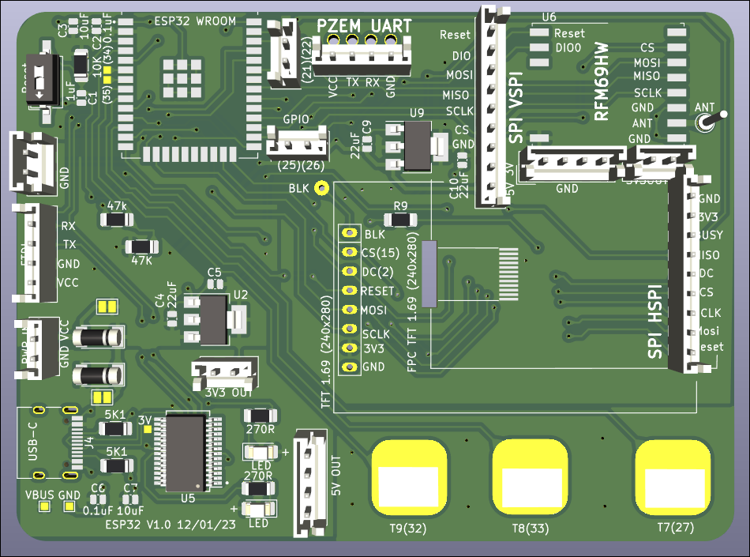
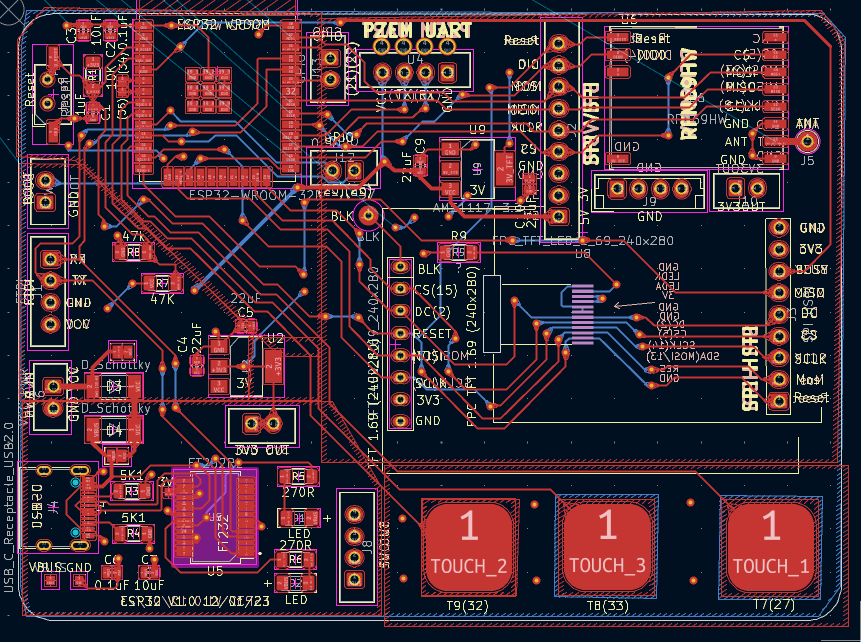

# Project5-ESP32-WROOM

Using an ESP32-WROOM + RFM69HW + PZEM + pinouts for a few different LED screens.

## Aim

Test out various different circuits - including touch buttons connected to ESP32 pins (I read that they could work as capacitative buttons)

It includes a connector for PZEM - i.e. ability to monitor 240V power use.

### PZEM v3
I bought my PZEM from Aliexpress but they are available everywhere, eg. [see here](https://esphome.io/components/sensor/pzemac.html)

## NOTE about OLED screen / board

> Note: this board does not connect BLK to 3V as the documentation said it was optional. This PCB works for the ST7789V2 boards that I have, but does not work for a newer ST7789V3 board where it **NEEDS**  BLK to be connected to 3V.

### Kicad Rendering of the PCB

### Kicad view of the PCB

 