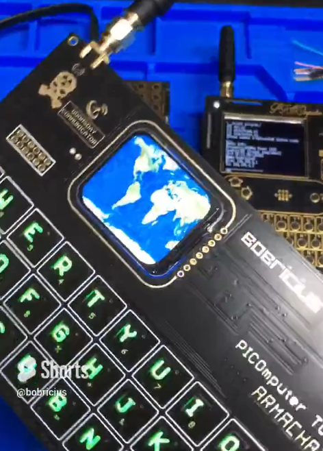
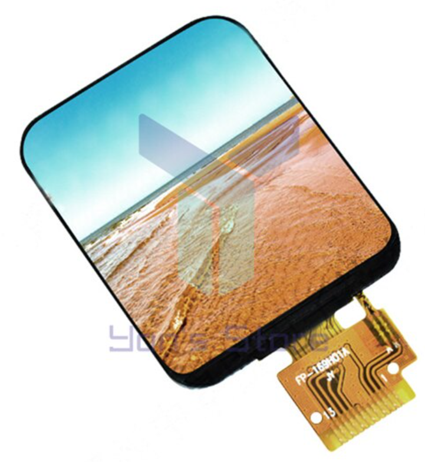

# Project 5: ESP32WROOM + some SMD soldering

So far, all my projects had involved modules for each component, such as using an ESP32-CAM, but I wanted to move to use more compact components - such as the ESP32-S2. The camera on the ESP32-CAM is amazing and simple to use - but for most of the projects I wanted to build having more GPIO pins available seemed like a better option.

At this point a friend sent me the following [link](https://twitter.com/i/status/1598419769077952512) showing an amazing PCB that was not much thicker than the PCB board but with a wonderul TFT screen built in

The twitter feed included a link to where you can buy the TFT on [AliExpress](https://www.aliexpress.com/item/1005003768946439.html)

Specs: 240*280 RGB Build-in ST7789 Driver Serial IPS Display

Note: this is **WAY** better than the SSD1306 I have been using which is a 0.96' screen 128x64 single colour screen

I wanted to try out these screens but I haven't soldered FPC cables before and so I bought several of these and one module that breaks out the wires into standard 2.54 mm pins. This way I could test the board to know it drives the panel ok before worrying about the FPC side

