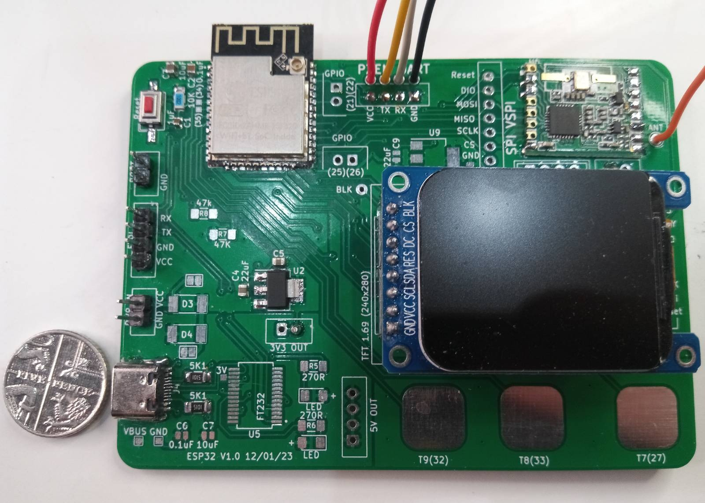

# Purpose of this project is to test out the 1.69' TFT screen

Previous projects have helped to confirm whether the GPIO pins are correctly soldered  (and that the ESP32 is operational). 
This project includes the breakout version of the 1.69' TFT 240x RGB https://www.aliexpress.com/item/1005003754253714.html

It will help test:
1. whether all the pins for the TFT are correctly wired + soldered
2. are they correctly configured for the hardware SPI port of the ESP32 **VSPI**
3. once it is proven that we can use the hardware SPI VSPI then the included graphics tests (copied from Adafruit example) demonstrate various text drawing / line drawing routines

**Once this project is working the board is known to have a working TFT, it can be used to display debug information for the next project.**

## Project update

The screen is an amazing screen and gives the ESP32 board a great way of displaying a weath of information in a rich way - far better than the .96' single colour TFT screen I used to use. By using the board version of the display I now have a working version to use as a benchmark - i.e. I can see how it is designed to hold the FPC display and what driving circuitry it uses. It also means that I know the circuit WILL work when I use the FPC TFT - i.e. always start from a known working premise (rtaher than use a never tested FPC TFT and then have too many unknowns when testing).